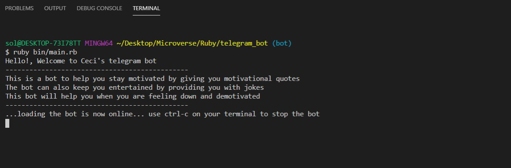
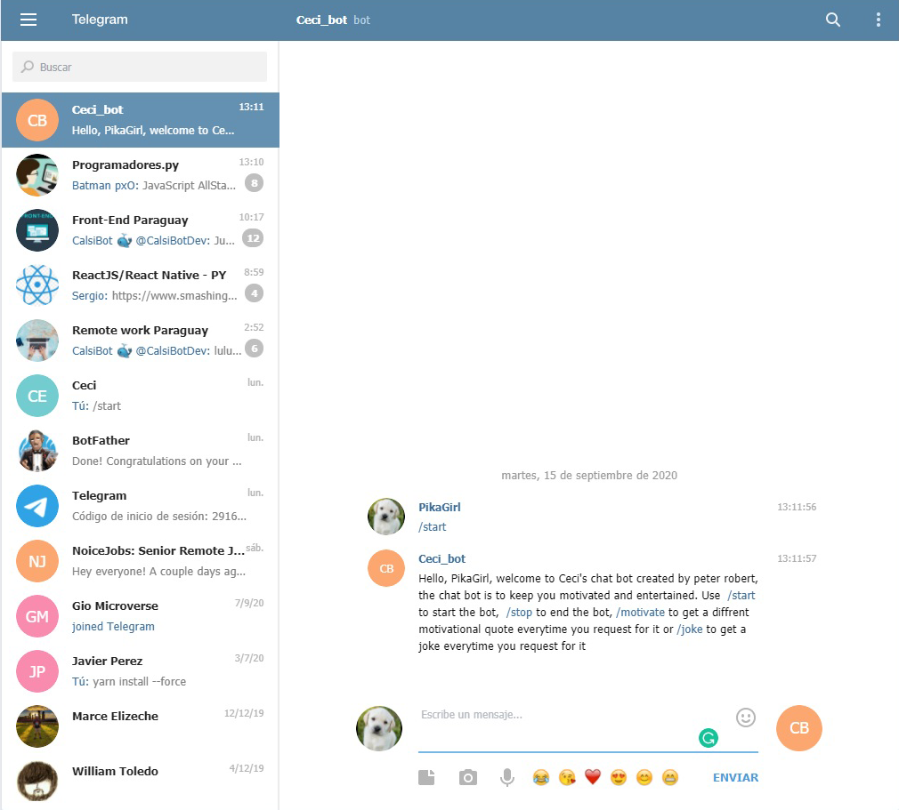
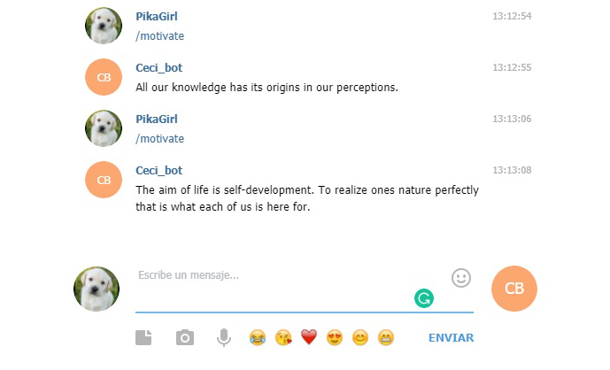
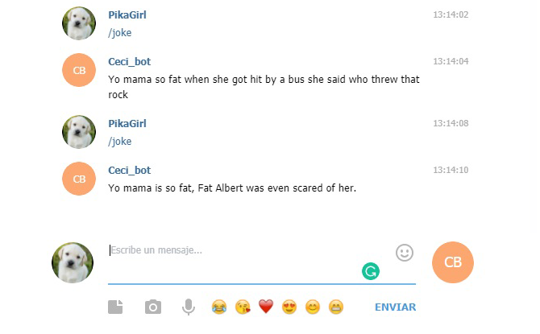
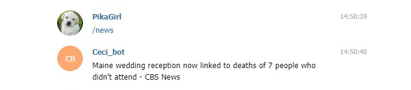
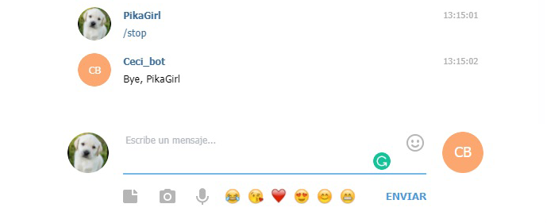
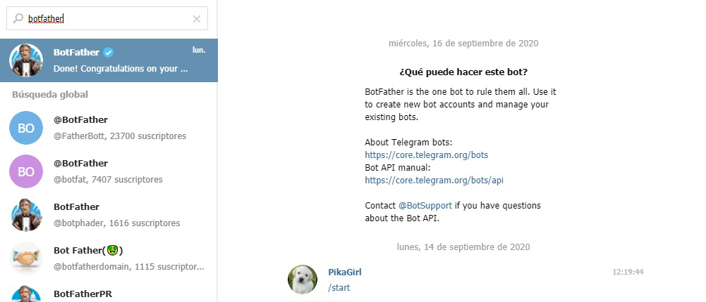
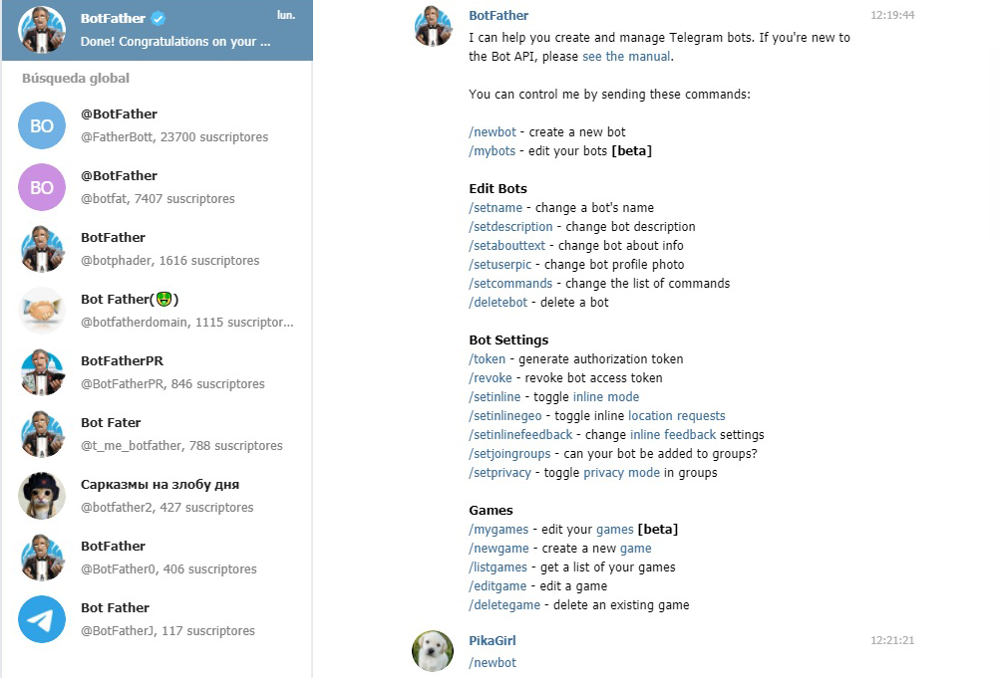
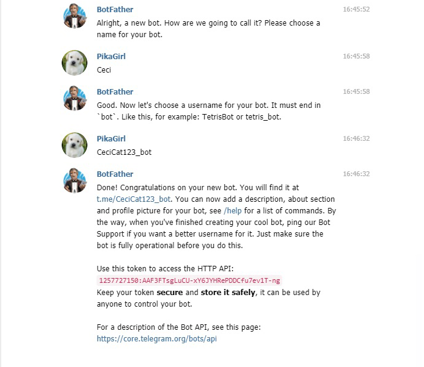
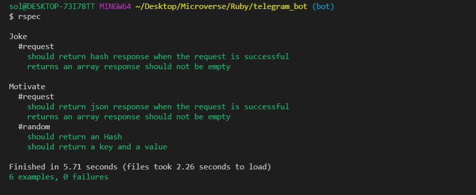

#  🧐  Ceci_bot

This is the capstone project, a solo project from the Ruby module on the Microverse program, it consists of making a Telegram bot.



The Telegram bot I created has four commands:

- ```/start``` : to start the bot and see the instructions and a greeting with your username.



- ```/motivate``` : to give you an inspirational random quote.



- ```/joke``` : to tell you a random joke.



- ```/news``` : to search for an interesting news.



- ```/stop``` : to stop the bot.




## 🔧 Built With

- Ruby 2.6
- Telegram Bot API
- Type fit Quotes API
- Yo mamma Jokes API


## 🔴 Live Demo

[Live Demo Link](https://repl.it/@CeciBenitez/telegrambot#README.md) 

[Video Demo](https://drive.google.com/file/d/1zLO9XmGNrIdRfexcN-uvz_VX0tOvUkVL/view?usp=sharing)


## 🛠 Getting Started
### Install 
Besides the live demo link, you can run those functions in you own local environment. In order to run, you need to install Ruby in your computer. For windows you can go to [Ruby installer](https://rubyinstaller.org/) and for MAC and LINUX you can go to [Ruby official site](https://www.ruby-lang.org/en/downloads/) for intructions on how to intall it. Then you can clone the project by typing ```git clone https://github.com/Ceci007/telegram_bot.git```

To get a local copy up and running follow these simple example steps.

- Go to the main page of te repo.
- Press the "Code" button and get the repo link.
- Clone it using git.

Then proceed to create your .env file and create a variable like this one ```API_TOKEN=1318191703:AAHqVe_Vqw4decD1v0Kzj0PE3IEcpK8VY4g``` you can use your token if you request one from the Telegram's BotFather, for this you need to install Telegram on your device.

Steps to request token: 
- Write the name "BotFather" on your telegram searchbar and send the command ```/start```.



- Now you can see a list with all commands and to create a new bot token you send ```/newbot```.



- last but not least you name your bot and choose an username.



### Run the bot 
Open your terminal and type ```ruby bin/main.rb``` in the root file of the project.


## Testing the bot
This bot was tested with [Rspec](https://en.wikipedia.org/wiki/RSpec) wich is a computer domain-specific language (DSL) testing tool written in programming language Ruby to test Ruby code. It is a behavior-driven development (BDD) framework which is extensively used in production applications. 

### Install
- In a terminal window type ```gem install rspec``` 
- Once rspec install has finished, go to project directory and type ```rspec --init``` 
- You will see a folder ```spec``` and a file ```.rspec``` 
- Inside ```spec``` folder you'll see a ```spec_helper.rb``` file.

### Run Rspec 
- Open a terminal window and type ```rspec``` command
- All tests should have passed 
 

## ✒️ Author

👤 **Cecilia Benitez**

- Github: [@Ceci007](https://github.com/Ceci007)
- LinkedIn:[LinkedIn](https://www.linkedin.com/in/cecilia-ben%C3%ADtez-casaccia-498669185/)


## 🤝 Contributing
Contributions, issues and feature requests are welcome!

Feel free to check the [issues page](https://github.com/Ceci007/telegram_bot/issues).


## 📝 License
This project is [MIT](lic.url) licensed.


